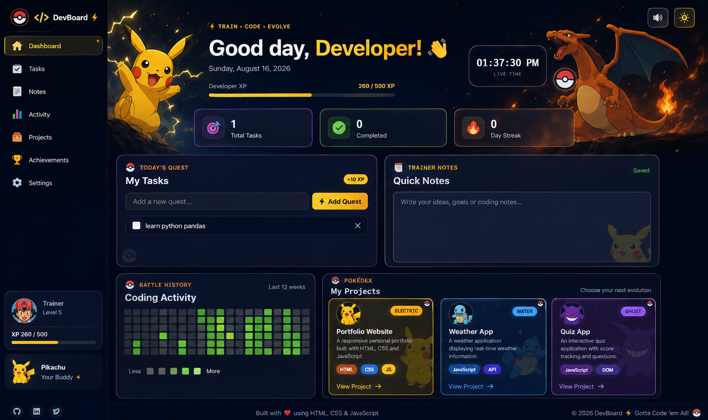

# ⚡ Pokémon DevBoard

> A futuristic Pokémon-inspired developer dashboard built with HTML, CSS, and JavaScript.

## 🌐 Live Demo

🚀 Coming soon with GitHub Pages

## 📸 Preview



## ✨ Features

- 🎨 Futuristic dark-themed developer dashboard
- ⚡ Interactive and visually engaging UI
- 📝 Developer notes section
- 📊 Developer-focused dashboard cards
- 🐉 Pokémon-inspired character section
- ✨ Smooth hover and visual effects
- 📱 Responsive layout
- 🧩 Clean HTML, CSS, and JavaScript structure

## 🛠️ Tech Stack

| Technology | Purpose |
|---|---|
| HTML5 | Website structure |
| CSS3 | Styling, layout and animations |
| JavaScript | Interactions and dynamic behavior |

## 🏗️ Project Structure

```text
pokemon-devboard/
│
├── index.html
├── style.css
├── script.js
└── README.md
